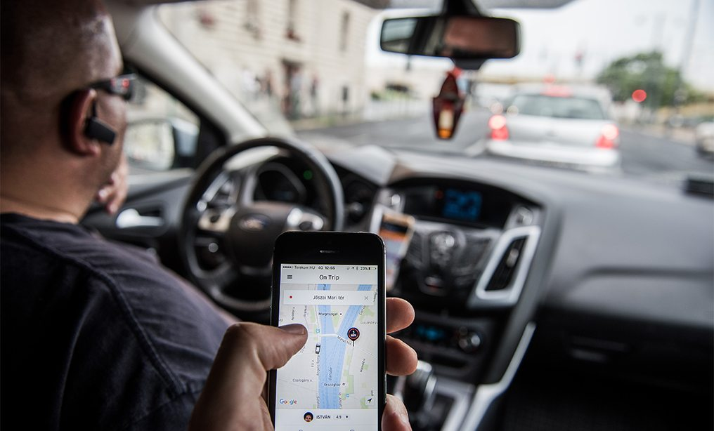

# Pool2School

## Background

   Welcome to Pool2School - SJSU's #1 Rideshare Service for Students in the Bay Area. This web application provides easy access to carpooling and rideshare services for SJSU students to commute to and from school! Anybody can sign up to become either a rider or driver by creating a profile - each input field in the profile is validated for errors and the details are stored on MySQL databases on the backend. 
   
   To hitch a ride, all you have to do is enter your pick-up and drop-off points and the rideshare algorithm will do its magic and match you with a driver. However, if you're a driver, you can enter the start and stop points for the usual route you'll be driving on and if a rider happens to be on the way or on a similar route, you will be matched with them to carpool. 

## Flask Application

The application is coded up using Python Flask with the following routes:
   * /signup/driver
   * /signup/rider
   * /login
   * /logout
   * /ride
   * /drive
  
## Database

The application will have a MySQL database on the backend. There will be two different tables - one for drivers and one for riders that will store the following details:
  * Firstname
  * Lastname
  * Email
  * Password (passwords will be hashed for security)
  * Phone Number
  * Driver's License
  * Source (Pick-up Point)
  * Destination (Drop-off Point)
  
## Technologies 

The following technologies will be used in creating this web application:
  * HTML5 
  * CSS3 / Bootstrap
  * JavaScript
  * Node.js
  * Google Maps API
  
